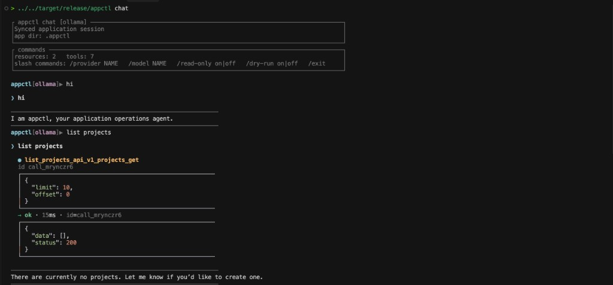
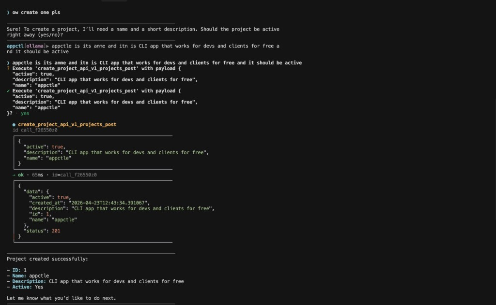
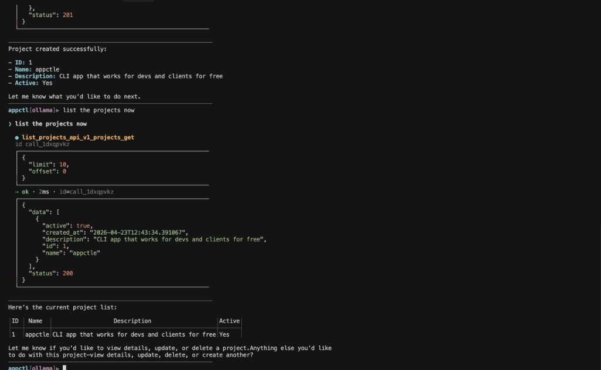
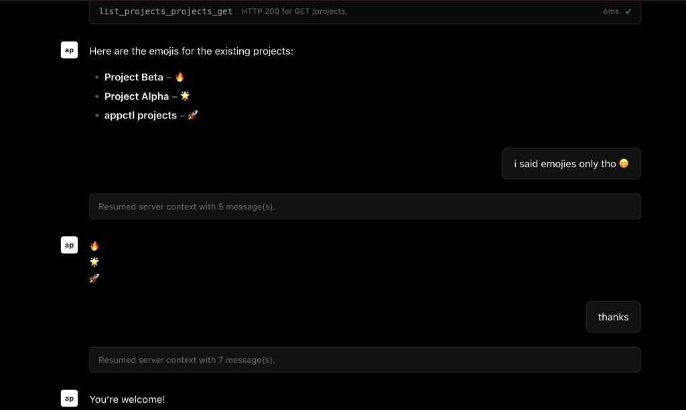

# appctl

> Give an LLM safe, auditable tools for your existing app.

`appctl` is a command-line operator layer for real applications. Point it at an
HTTP API, OpenAPI document, database, Supabase/PostgREST service, MCP server, or
supported framework project. It writes a local `.appctl/` contract, exposes the
discovered actions as typed tools, and runs the tool calls requested by your
configured LLM.

In practice, appctl lets you ask things like "list overdue invoices", "create a
refund", or "summarize failed jobs" against your own backend without building a
custom agent integration first. Your app remains the source of truth; appctl
adds setup, auth handling, safety checks, execution, and local audit history.

**Documentation:** <https://esubalew.dev/appctl>  
**Repository:** <https://github.com/Esubaalew/appctl>

## What appctl does

1. Reads your app surface from a supported source such as OpenAPI, Django/DRF,
   Rails, Laravel, ASP.NET, Strapi, Supabase/PostgREST, SQL schema, URL login
   flow, MCP, or a plugin.
2. Generates `.appctl/schema.json` and `.appctl/tools.json`, a local contract
   describing what the model is allowed to call.
3. Sends your prompt to the configured provider and executes requested tool calls
   through appctl.
4. Records tool calls, arguments, provenance, status, and results in local
   history so the run can be inspected later.

appctl is not a web framework, hosted database, or LLM provider. It sits beside
your existing application and controls how an AI agent can use it.

## Install

```bash
cargo install appctl
```

Build from a clone, or install with a custom web UI bundle: see
[Installation](https://esubalew.dev/appctl/docs/installation/).

## Commands (overview)

| Command | Purpose |
| --- | --- |
| `appctl setup` | Guided first-run flow: provider, sync source, checks, and next steps. |
| `appctl init` | Create `.appctl/config.toml` and store provider secrets. |
| `appctl sync` | Generate `.appctl/schema.json` and `tools.json` from a source (e.g. `--openapi`, `--django`, `--db`). |
| `appctl chat` / `appctl run` | Send a prompt; the model may call tools via `appctl`. |
| `appctl serve` | HTTP and WebSocket API plus bundled web UI. |

## Quick start

```bash
appctl setup
appctl chat
```

Run `setup` from the app/project folder you want to control. It creates or reuses
that folder's `.appctl/`, guides provider setup, syncs tools, verifies the target
API, and tells you exactly how to open the terminal or web console.

For protected APIs, prefer environment-backed target auth:

```bash
export API_TOKEN="..."
appctl setup
# Auth header prompt:
# Authorization: Bearer env:API_TOKEN
```

Advanced manual setup is still available:

```bash
appctl init
appctl sync --openapi https://api.example.com/openapi.json --base-url https://api.example.com
appctl doctor --write
```

Full CLI reference, sync sources, providers, `serve`, and plugins are covered
in the [documentation](https://esubalew.dev/appctl/docs/introduction/).

## Demos

The examples below use an OpenAPI-backed app and Ollama. Your session shows the
synced `.appctl/` contract, discovered tools, and inline tool calls (arguments
and JSON responses). Slash commands adjust provider, model,
read-only mode, and dry-run.

### Terminal session: hello and list projects



```text
$ ./target/release/appctl chat

┌ appctl chat [ollama] ─────────────────────────┐
│ Synced application session                      │
│ app dir: .appctl                                │
└─────────────────────────────────────────────────┘

┌ commands ───────────────────────────────────────┐
│ resources: 2  tools: 7                          │
│ /provider NAME  /model NAME  /read-only on|off   │
│ /dry-run on|off  /exit                           │
└─────────────────────────────────────────────────┘

appctl[ollama]▶ hi
> hi
I am appctl, your application operations agent.

appctl[ollama]▶ list projects
> list projects
● list_projects_api_v1_projects_get  id call_mrynczr6
{
  "limit": 10,
  "offset": 0
}
→ ok  15ms  id=call_mrynczr6
{
  "data": [],
  "status": 200
}
There are currently no projects. Let me know if you'd like to create one.
```

### Terminal session: create a project (confirm before write)



```text
appctl[ollama]▶ ow create one pls
Sure! To create a project, I'll need a name and a short description.
Should the project be active right away (yes/no)?

appctl[ollama]▶ appctle is its name and it is CLI app that works for devs
  and clients for free and it should be active

? Execute 'create_project_api_v1_projects_post' with payload
  { "active": true, "description": "...", "name": "appctle" }

}? yes

● create_project_api_v1_projects_post  id call_f26550z0
{
  "active": true,
  "description": "CLI app that works for devs and clients for free",
  "name": "appctle"
}
→ ok · 65ms · id=call_f26550z0
{
  "data": {
    "active": true,
    "created_at": "2024-04-23T12:43:34.391067",
    "description": "CLI app that works for devs and clients for free",
    "id": 1,
    "name": "appctle"
  },
  "status": 201
}

Project created successfully:
- ID: 1
- Name: appctle
- Description: CLI app that works for devs and clients for free
- Active: Yes
```

### Terminal session: list projects as a table



```text
appctl[ollama]▶ List the projects now
● list_projects_api_v1_projects_get  id call_1dxqpvkz
{
  "limit": 10,
  "offset": 0
}
→ ok · 2ms · id=call_1dxqpvkz
{
  "data": [
    {
      "active": true,
      "created_at": "...",
      "description": "CLI app that works for devs and clients for free",
      "id": 1,
      "name": "appctle"
    }
  ],
  "status": 200
}

Here's the current project list:
┌────┬─────────┬─────────────────────────────────────────────┬────────┐
│ ID │ Name    │ Description                                 │ Active │
├────┼─────────┼─────────────────────────────────────────────┼────────┤
│ 1  │ appctle │ CLI app that works for devs and clients...  │ Yes    │
└────┴─────────┴─────────────────────────────────────────────┴────────┘
```

### Web UI: same API, conversational formatting

With `appctl serve`, you can use the bundled console against the same tools.
The model can follow formatting instructions (here, listing project labels with
emojis, then replying with emojis only when asked).



## License

MIT © [Esubalew](https://esubalew.dev)
